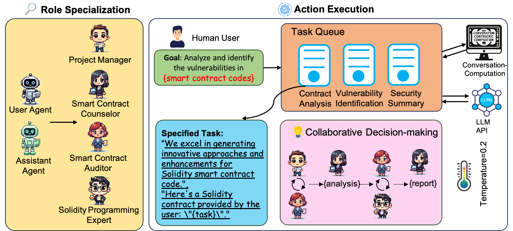
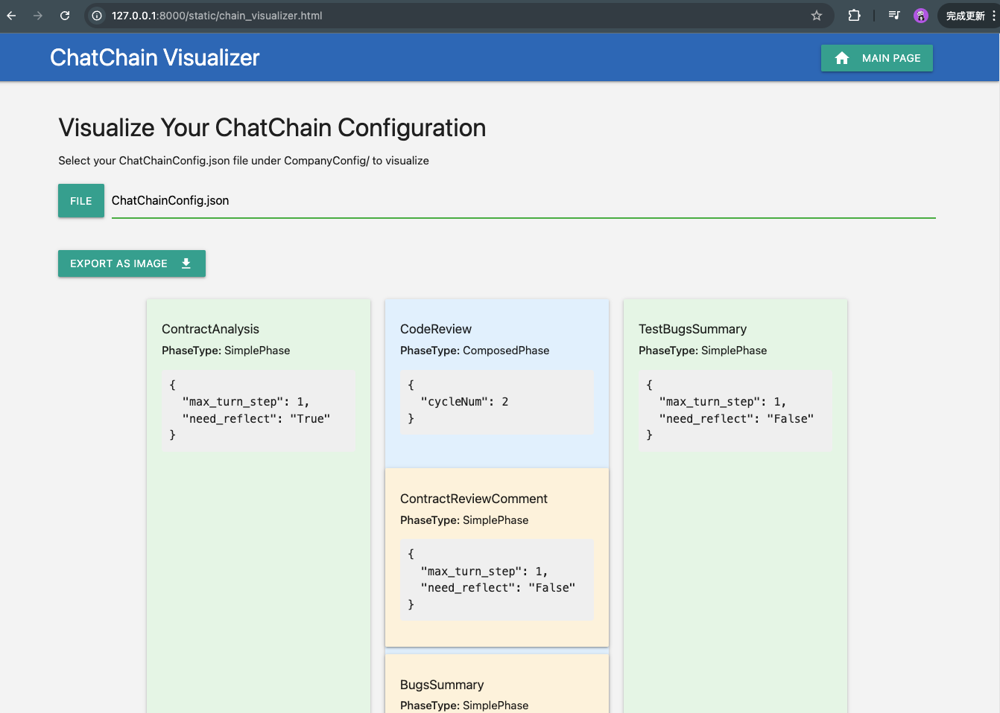
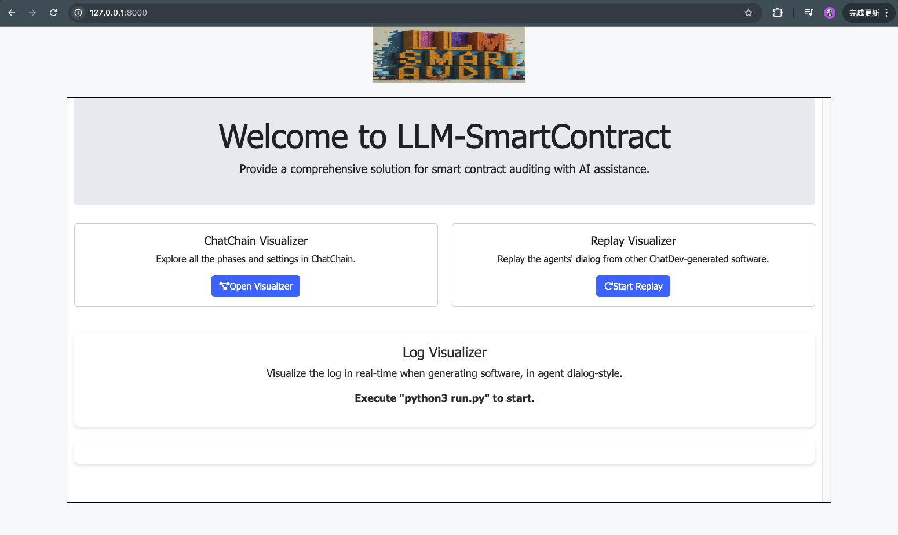
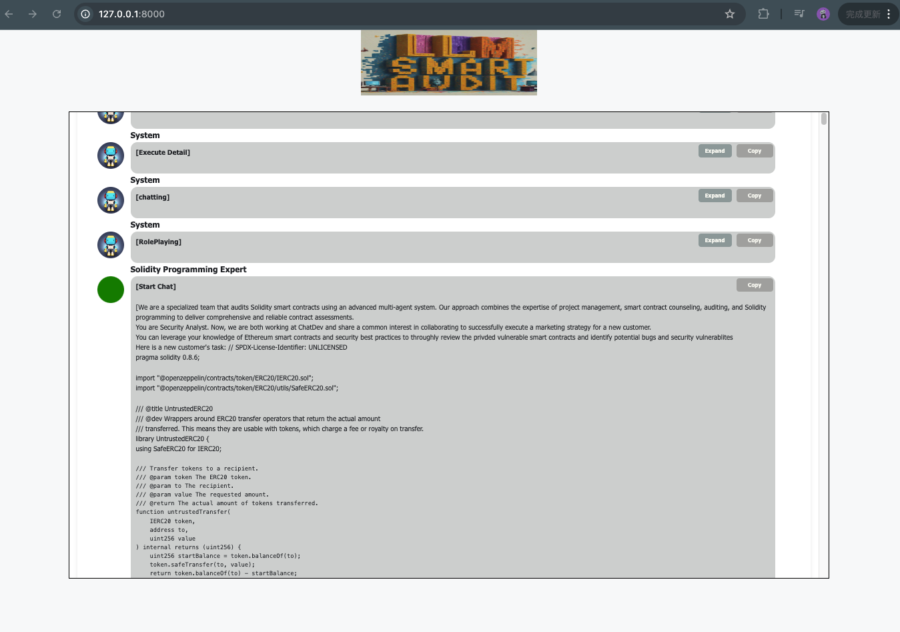
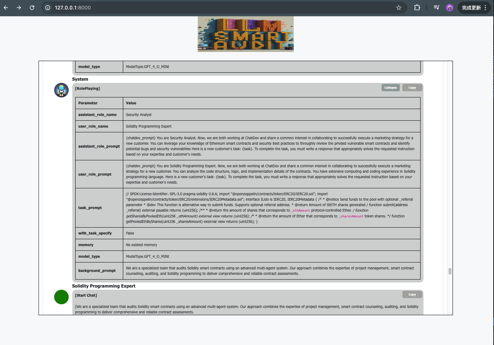
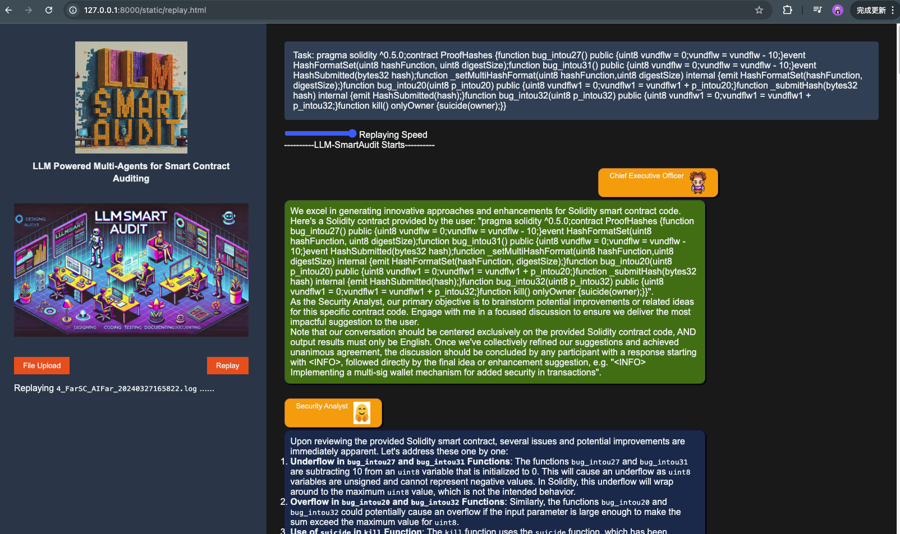
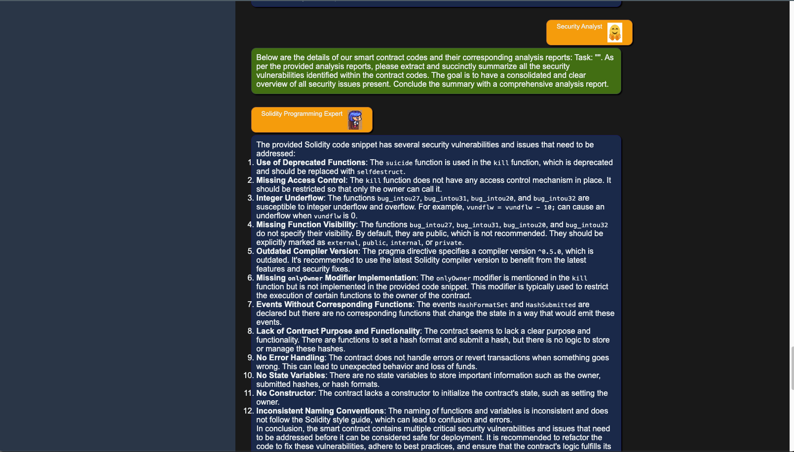

# LLM-Powered Multi-Agent for Smart Contract Auditing

<div align="center">
  
  <br>
  
</div>

## 🕌 LLM-SmartAudit System

<div align="center">
  
</div>

LLM-SmartAudit is a cutting-edge tool designed to audit smart contracts using advanced language models. Our system provides a comprehensive solution for smart contract auditing, including:

- Automated vulnerability detection flow
- Batch contract analysis
- Security analysis and testing
- User-friendly interface
- Powerful backend to support the entire auditing process

## ⚡️ Getting Started

### 🖥️ Terminal Usage

For single contract analysis, follow these steps:

#### 1. Install Environment

```bash
pip install -r requirements.txt
```

#### 2. Set Your OpenAI API Key

```bash
export OPENAI_API_KEY="your_openai_api_key"
```

#### 3. Run the Tool

Input your Solidity smart contract code into `task`.

- Run BA mode:
  ```bash
  python3 run.py --org "" --config "SmartContractBA" --task "" --name ""
  ```

- Run TA mode:
  ```bash
  python3 run.py --org "" --config "SmartContractTA" --task "" --name ""
  ```

### 🛠️ Notebook Usage

For batch contract analysis and result compilation, we provide the following notebooks:

| Feature | Notebook Link |
|---------|---------------|
| **Automatic Batch Contract Analysis** | [▶️ Start Analysis](https://colab.research.google.com/drive/1Y_SHymcZGr98832GTSF46J1_JHtHgYhy?usp=sharing) |
| **Result Compilation** | [▶️ Compile Results](https://colab.research.google.com/drive/11MYFl14fvdVtEHqKxFXDSMY_L80PzWA7?usp=sharing) |

### 💻️ Web Visualization

To start the web interface:

```bash
python3 visualizer/app.py
```

Then open your browser and navigate to: http://127.0.0.1:8000/

#### Workflow of Our Auditing Process

<div align="center">
  
</div>

#### Monitoring the Running Process

<div align="center">
  
  
  
</div>

#### Replay Multi-conversations Between LLM-based Agents

<div align="center">
  
  
</div>

## 🐞 Detector Design in TA Mode

| ID | Scenario | Description |
|---|---------|-------------------------------|
|1|ArithmeticDetector| Integer Overflow/Underflow vulnerabilities can occur in the following cases: <br> 1. When the result of an arithmetic operation exceeds the maximum or falls below the minimum value that can be stored in the data type being used in the contract code. <br> 2. When the contract does not include any checks for integer overflow/underflow when performing calculations involving tokens and prices. <br> 3. When the contract uses `SafeMath`, ensure that each arithmetic operation uses `SafeMath` functions to prevent overflow and underflow. <br> Please conduct a thorough analysis, considering the following information: <br> 1. Review the contract's code logic to identify any potential areas where arithmetic operations might cause overflow or underflow. <br> 2. Examine critical functions, particularly those involving token transfers, balances, and price calculations, to ensure they have proper checks in place. <br> 3. Verify that every arithmetic operation in the contract uses `SafeMath` functions to prevent overflow and underflow.
|||

<div align="center">

  
</div>